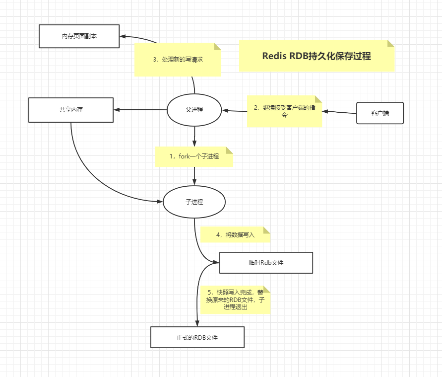

# Redis 学习总结


## 一、 什么是Redis

官网简介：

Redis是开源的（BSD许可）内存**数据结构存储**，用作数据库，缓存和消息代理。它支持数据结构，例如 [String](https://redis.io/topics/data-types-intro#strings)，[Hash](https://redis.io/topics/data-types-intro#hashes)，[List](https://redis.io/topics/data-types-intro#lists)，[Set](https://redis.io/topics/data-types-intro#set)，带范围查询的[Zset](https://redis.io/topics/data-types-intro#sorted-sets)，[bitmap](https://redis.io/topics/data-types-intro#bitmaps)，[hyperloglogs](https://redis.io/topics/data-types-intro#hyperloglogs)，带有半径查询的[geo](https://redis.io/commands/geoadd)和[stream](https://redis.io/topics/streams-intro)。Redis具有内置的[复制](https://redis.io/topics/replication)，[Lua脚本](https://redis.io/commands/eval)，[LRU逐出](https://redis.io/topics/lru-cache)，[事务](https://redis.io/topics/transactions)和不同级别的[磁盘持久性](https://redis.io/topics/persistence)，并通过以下方式提供高可用性[Redis Sentinel](https://redis.io/topics/sentinel)和[Redis Cluster](https://redis.io/topics/cluster-tutorial)自动分区。

您可以 对这些类型运行**原子操作**，例如[追加到字符串](https://redis.io/commands/append)； [在哈希中增加值](https://redis.io/commands/hincrby) ; [将元素推送到列表](https://redis.io/commands/lpush) ; [计算集的交集](https://redis.io/commands/sinter)， [并集](https://redis.io/commands/sunion)和[差](https://redis.io/commands/sdiff) ; 或[获得排序集中排名最高的成员](https://redis.io/commands/zrangebyscore)。

为了获得出色的性能，Redis使用 **内存中的数据集**。根据您的用例，您可以通过[将数据集](https://redis.io/topics/persistence#snapshotting) 偶尔[转储到磁盘上](https://redis.io/topics/persistence#snapshotting)，或者通过[将每个命令附加到log](https://redis.io/topics/persistence#append-only-file)来持久化它。如果只需要功能丰富的网络内存缓存，则可以选择禁用持久性。

Redis还支持琐碎的设置[主从异步复制](https://redis.io/topics/replication)，具有非常快速的非阻塞式第一次同步，自动重新连接以及网络拆分中的部分重新同步。

其他功能包括：

- [交易次数](https://redis.io/topics/transactions)
- [发布/订阅](https://redis.io/topics/pubsub)
- [Lua脚本](https://redis.io/commands/eval)
- [生存时间有限的键](https://redis.io/commands/expire)
- [LRU收回钥匙](https://redis.io/topics/lru-cache)
- [自动故障转移](https://redis.io/topics/sentinel)

您可以从[大多数编程语言中](https://redis.io/clients)使用Redis 。

Redis是用**ANSI C**编写的，并且可以在大多数POSIX系统中使用，例如Linux，* BSD，OS X，而无需外部依赖。Linux和OS X是Redis开发和测试最多的两个操作系统，我们**建议使用Linux进行部署**。Redis可以在基于Solaris的系统中使用，例如SmartOS，但是*尽力提供*了支持。Windows版本没有官方支持。

使用场景
1. 去最新n个数据的操作
2. 排行榜，取top n个数据 //最佳人气前10条
3. 精确的设置过期时间
4. 计数器
5. 实时系统， 反垃圾系统
6. pub， sub发布订阅构建实时消息系统
7. 构建消息队列
8. 缓存

```xml
基于内存(速度快)。
单线程（工作线程是单线程 Worker Thread是单线程，但是IO Thread 是多线程）。
连接很多：IO模型 epoll。
有五种基本数据类型和三种特殊的数据类型。
有本地方法：计算向数据移动
```

---

## 二、Redis的5种基本数据类型和三种特殊的数据类型

Redis五种基本的数据类型有String,Hash,List，Set,Zset

- String

  String  支持存储字符串，数字，和二进制数据。(其实)
  
  场景；分布式Session缓存，限流，计数器，分布式锁。
  
  常用命令:
  
  ```xml
   set name cxx
      get name
      getrange name 0 -1        字符串分段
      getset name new_cxx       设置值，返回旧值
      mset key1 key2            批量设置
      mget key1 key2            批量获取
      setnx key value           不存在就插入（not exists）
      setex key time value      过期时间（expire）
      setrange key index value  从index开始替换value
      incr age        递增
      incrby age 10   递增
      decr age        递减
      decrby age 10   递减
      incrbyfloat     增减浮点数
      append          追加
      strlen          长度
      getbit/setbit/bitcount/bitop    位操作
  ```


- Hash

  支持Hash表存储,很适合存储对象，每个Hash最多可以存储2^32^-1个键值对。

  ```xml
  hash
      hset myhash name cxx
      hget myhash name
      hmset myhash name cxx age 25 note "i am notes"
      hmget myhash name age note   
      hgetall myhash               获取所有的
      hexists myhash name          是否存在
      hsetnx myhash score 100      设置不存在的
      hincrby myhash id 1          递增
      hdel myhash name             删除
      hkeys myhash                 只取key
      hvals myhash                 只取value
      hlen myhash                  长度
  ```

- List

edis列表是简单的字符串列表，按照插入顺序排序。你可以添加一个元素到列表的头部（左边）或者尾部（右边）

一个列表最多可以包含 2^32^ - 1 个元素 (4294967295, 每个列表超过40亿个元素)

lpush:从左边插入，rpush:从右边插入，lrange，遍历一定范围的值，从左边开始为0，负数代表从尾部象前		

```xml
list
    lpush mylist a b c  左插入
    rpush mylist x y z  右插入
    lrange mylist 0 -1  数据集合
    lpop mylist  弹出元素
    rpop mylist  弹出元素
    llen mylist  长度
    lrem mylist count value  删除
    lindex mylist 2          指定索引的值
    lset mylist 2 n          索引设值
    ltrim mylist 0 4         删除key
    linsert mylist before a  插入
    linsert mylist after a   插入
    rpoplpush list list2     转移列表的数据
```

- Set

Redis 的 Set 是 String 类型的无序集合。集合成员是唯一的，这就意味着集合中不能出现重复的数据。

Redis 中集合是通过哈希表实现的，所以添加，删除，查找的复杂度都是 O(1)。

集合中最大的成员数为 2^32^ - 1 (4294967295, 每个集合可存储40多亿个成员)

Redis Set 是 String 的无序排列。SADD 指令把新的元素添加到 set 中。对 set 也可做一些其他的操作，比如测试一个给定的元素是否存在，对不同 set 取交集，并集或差。

```xml
sadd myset redis 
    smembers myset       数据集合
    srem myset set1         删除
    sismember myset set1 判断元素是否在集合中
    scard key_name       个数
    sdiff | sinter | sunion 操作：集合间运算：差集 | 交集 | 并集
    srandmember          随机获取集合中的元素
    spop                 从集合中弹出一个元素
```

- Zset（ziplist(压缩表)和skiplist(跳跃表)）

Redis 有序集合和集合一样也是string类型元素的集合,且不允许重复的成员。

不同的是每个元素都会关联一个double类型的分数。

redis正是通过分数来为集合中的成员进行从小到大的排序。

有序集合的成员是唯一的,但分数(score)却可以重复。

集合是通过哈希表实现的，所以添加，删除，查找的复杂度都是O(1)。

 集合中最大的成员数为 2^32^ - 1 (4294967295, 每个集合可存储40多亿个成员)。

通过zadd去添加，给每个value前添加一个score,最后根据score来进行排序。

```xml
zadd zset 1 one
    zadd zset 2 two
    zadd zset 3 three
    zincrby zset 1 one              增长分数
    zscore zset two                 获取分数
    zrange zset 0 -1 withscores     范围值
    zrangebyscore zset 10 25 withscores 指定范围的值
    zrangebyscore zset 10 25 withscores limit 1 2 分页
    Zrevrangebyscore zset 10 25 withscores  指定范围的值
    zcard zset  元素数量
    Zcount zset 获得指定分数范围内的元素个数
    Zrem zset one two        删除一个或多个元素
    Zremrangebyrank zset 0 1  按照排名范围删除元素
    Zremrangebyscore zset 0 1 按照分数范围删除元素
    Zrank zset 0 -1    分数最小的元素排名为0
    Zrevrank zset 0 -1  分数最大的元素排名为0
    Zinterstore
    zunionstore rank:last_week 7 rank:20150323 rank:20150324 rank:20150325  weights 1 1 1 1 1 1 1
```


**其他指令**

```xml
key
    keys * 获取所有的key
    select 0 选择第一个库
    move myString 1 将当前的数据库key移动到某个数据库,目标库有，则不能移动
    flush db      清除指定库
    randomkey     随机key
    type key      类型
    
    set key1 value1 设置key
    get key1    获取key
    mset key1 value1 key2 value2 key3 value3
    mget key1 key2 key3
    del key1   删除key
    exists key      判断是否存在key
    expire key 10   10过期
    pexpire key 1000 毫秒
    persist key     删除过期时间
```


```xml
订阅与发布：
    订阅频道：subscribe chat1
    发布消息：publish chat1 "hell0 ni hao"
    查看频道：pubsub channels
    查看某个频道的订阅者数量: pubsub numsub chat1
    退订指定频道： unsubscrible chat1   , punsubscribe java.*
    订阅一组频道： psubscribe java.*
```

---

## 三、Redis的事务

**Redis事务相关命令：**

- **MULTI ：**开启事务，redis会将后续的命令逐个放入队列中，然后使用**EXEC命令来原子化**执行这个命令系列。
- **EXEC：**执行事务中的所有操作命令。
- **DISCARD：**取消事务，放弃执行事务块中的所有命令。
- **WATCH：**监视一个或多个key,如果事务在执行前，这个key(或多个key)被其他命令修改，则事务被中断，不会执行事务中的任何命令。
- **UNWATCH：**取消WATCH对所有key的监视。

Redis的事务不是原子性的。

Redis事务从开始到结束通常会通过三个阶段:

1.事务开始

2.命令入队

3.事务执行


事务失败处理：

- 语法错误（编译时错误），这时候整个事务会回滚。
- Redis类型错误（运行时错误），此时事务并没有回滚，而是跳过错误的命令继续执行。

```
注意：为什么不支持事务回滚：

总结一下，多数事务失败是由语法错误或者数据结构类型错误导致的，语法错误说明在命令入队前就进行检测的，而类型错误是在执行时检测的，Redis为提升性能而采用这种简单的事务，这是不同于关系型数据库的，特别要注意区分。

严格的说Redis的命令是原子性的，而事务是非原子性的，我们要让Redis事务完全具有事务回滚的能力，需要借助于命令WATCH来实现。

Redis使用WATCH命令来决定事务是继续执行还是回滚，那就需要在MULTI之前使用WATCH来监控某些键值对，然后使用MULTI命令来开启事务，执行对数据结构操作的各种命令，此时这些命令入队列。

当使用EXEC执行事务时，首先会比对WATCH所监控的键值对，如果没发生改变，它会执行事务队列中的命令，提交事务；如果发生变化，将不会执行事务中的任何命令，同时事务回滚。当然无论是否回滚，Redis都会取消执行事务前的WATCH命令。

```


---

## 四、Redis持久化机制AOF和RDB 优缺点

- **RDB机制**

RDB 是以快照的形式将内存中的数据，持久化到磁盘。默认的文件名dump.rdb。文件放置在Redis的启动目录下面，可以在Redis的配置文件中指定相应的文件名称。

既然Reids是通过拍快照的形式把某一时刻的数据快照下来的，那么是怎么触发这个快照动作的尼？

Redis在配置文件中有配置自动触发RDB的条件，比如 “save m n”，指的是m秒内，数据集内触发了n次修改，自动触发**bgsave**。

**bgsave**:Redis 服务器后台会fork出一个子线程，RDB的持久化过程由子进程负责，完成后自动结束。阻塞只发生在fork阶段（一般时间比较短）。



- **AOF机制**

以日志记录的方式将所有的写操作追加到文件中。

AOF方式的方式带来了另外一个问题，持久化文件会越来越大。

为了压缩aof的持久化文件。redis提供了bgrewriteaof命令。将内存中的数据以命令的方式保存到临时文件中，同时会fork出一条新进程来将文件重写。

重写aof文件的操作，并没有读取旧的aof文件，而是将整个内存中的数据库内容用命令的方式重写了一个新的aof文件，这点和快照有点类似。

**AOF的触发机制：**

（1）每修改同步always：同步持久化 每次发生数据变更会被立即记录到磁盘 性能较差但数据完整性比较好

（2）每秒同步everysec：异步操作，每秒记录 如果一秒内宕机，有数据丢失

（3）不同no：从不同步


**AOF和RDB的优缺点：**

**AOF优点：**

（1）AOF可以更好的保护数据不丢失，一般AOF会每隔1秒，通过一个后台线程执行一次fsync操作，最多丢失1秒钟的数据。

（2）AOF日志文件没有任何磁盘寻址的开销，写入性能非常高，文件不容易破损。

（3）AOF日志文件即使过大的时候，出现后台重写操作，也不会影响客户端的读写。

（4）AOF日志文件的命令通过非常可读的方式进行记录，这个特性非常适合做灾难性的误删除的紧急恢复。比如某人不小心用flushall命令清空了所有数据，只要这个时候后台rewrite还没有发生，那么就可以立即拷贝AOF文件，将最后一条flushall命令给删了，然后再将该AOF文件放回去，就可以通过恢复机制，自动恢复所有数据。

**AOF缺点：**

（1）对于同一份数据来说，AOF日志文件通常比RDB数据快照文件更大

（2）AOF开启后，支持的写QPS会比RDB支持的写QPS低，因为AOF一般会配置成每秒fsync一次日志文件，当然，每秒一次fsync，性能也还是很高的

（3）以前AOF发生过bug，就是通过AOF记录的日志，进行数据恢复的时候，没有恢复一模一样的数据出来。

**RDB优点：**

（1）RDB文件紧凑，全量备份，非常适合用于进行备份和灾难恢复。

（2）生成RDB文件的时候，redis主进程会fork()一个子进程来处理所有保存工作，主进程不需要进行任何磁盘IO操作。

（3）RDB 在恢复大数据集时的速度比 AOF 的恢复速度要快。

**RDB缺点：**

RDB快照是一次全量备份，存储的是内存数据的二进制序列化形式，存储上非常紧凑。当进行快照持久化时，会开启一个子进程专门负责快照持久化，子进程会拥有父进程的内存数据，父进程修改内存子进程不会反应出来，所以在快照持久化期间修改的数据不会被保存，可能丢失数据。

---

## 五、Redis淘汰策略

Redis作为当前最常用的开源内存数据库，性能十分高，据官方数据表示Redis读的速度是**110000**次/s,写的速度是**81000**次/s 。而且Redis支持数据持久化，众多数据结构存储。

但是长期将Redis作为缓存使用，难免会遇到内存空间存储瓶颈，当Redis内存超出物理内存限制时，内存数据就会与磁盘产生频繁交换，使Redis性能急剧下降。此时如何淘汰无用数据释放空间，存储新数据就变得尤为重要了。

对此，Redis在生产环境中，采用配置参数maxmemory 的方式来限制内存大小。当实际存储内存超出maxmemory 参数值时，开发者们可以通过这几种方法——Redis内存淘汰策略，来决定如何腾出新空间继续支持读写工作。

**当前Redis3.0版本支持的淘汰策略有6种：**

（1）**volatile-lru**：从设置过期时间的数据集（server.db[i].expires）中挑选出最近最少使用的数据淘汰。没有设置过期时间的key不会被淘汰，这样就可以在增加内存空间的同时保证需要持久化的数据不会丢失。

（2） **volatile-ttl**：除了淘汰机制采用LRU，策略基本上与volatile-lru相似，从设置过期时间的数据集（server.db[i].expires）中挑选将要过期的数据淘汰，ttl值越大越优先被淘汰。

（3） **volatile-random**：从已设置过期时间的数据集（server.db[i].expires）中任意选择数据淘汰。当内存达到限制无法写入非过期时间的数据集时，可以通过该淘汰策略在主键空间中随机移除某个key。

（4）**allkeys-lru**：从数据集（server.db[i].dict）中挑选最近最少使用的数据淘汰，该策略要淘汰的key面向的是全体key集合，而非过期的key集合。

（5）**allkeys-random**：从数据集中选择任意数据淘汰。

（6）**no-enviction**：禁止驱逐数据，也就是当内存不足以容纳新入数据时，新写入操作就会报错，请求可以继续进行，线上任务也不能持续进行，采用no-enviction策略可以保证数据不被丢失，这也是系统默认的一种淘汰策略。

---

## 六、Redis使用的过程中存在的问题

**缓存穿透**：查询一个本就不存在的数据，缓存没有命中，直接查询DB，但是DB里面也未查询到改数据，没有数据就不回写入缓存。导致每次查询都请求到DB，流量大的时候，DB就可能挂掉。

解决方案：1，使用布隆过滤。2，缓存NUll值，并设置一个较短的过期时间。

**缓存击穿**：缓存在某个时间点过期，此时有大量的并发请求，直接打到DB,瞬间把后台DB压垮。

解决方案：1，热点数据不过期。2，使用互斥锁。

**缓存雪崩**：指我们对数据缓存设置了相同的过期时间，导致大量的缓存数据集体失效，大量的请求直接请求到DB，流量过大时，DB就会挂掉。

解决方案：1，对应不同的key设置随机的超时时间。2，使用互斥锁。


---

## 七、Redis的IO模型  IO Thread

---

## 八、Redis集群的实现方式 


